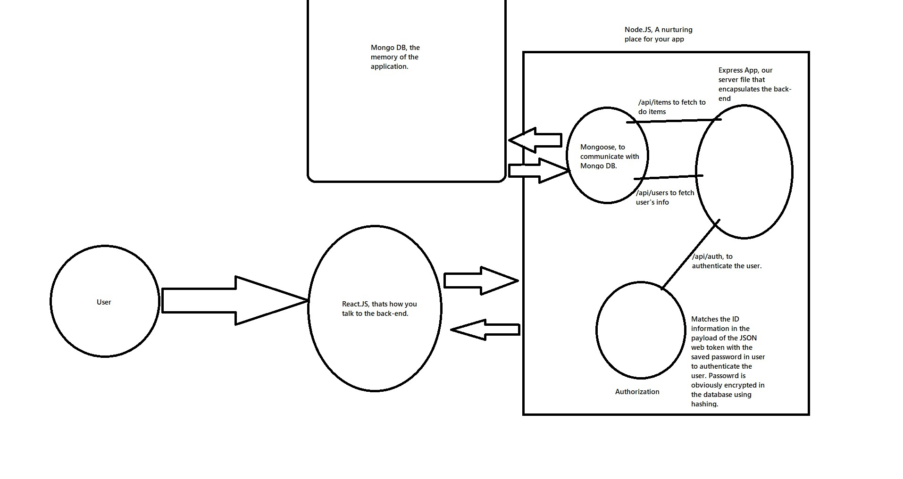

# Simple-To-Do

Learning the basics of the MERN stack by building a basic To-Do Application using the MERN (Mongo DB, Express, React and Node) stack with dependencies like concurrently, redux, JSON web tokens, config, nodemon and hosting on heroku.

https://limitless-garden-84113.herokuapp.com/

Explanation of different Dependencies used by the app:

Flow Chart:

heroku-todo-mern
